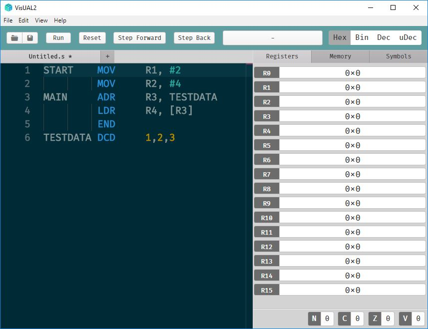

# Guide

## Syntax

Each line consists of *words* separated by whitespace, `,` or `;`. Additional spaces or tabs between or before words are ignored. Unlike many assemblers, while space has no significance (other than to separate words). If the second word is a valid op-code then the first word will be interpreted as a label.


```
[Label] OPCODE operand1, operand2, operand3 [ ; comment ]
```


## [Data Processing Instructions](https://tomcl.github.io/visual2.github.io/data-processing.html#arm-data-processing-instructions)

## [Single Memory Transfer Instructions](#mem-instructions)

## [Multiple Register Memory Transfer Instructions](#mult-mem-instructions)


## Introduction



Each line of a VisUAL program defines part of an ARM CPU's initial memory. **Instruction lines** define the contents of a **code memory area**, starting from memory address 0. **Data definition lines** define data locations used by the program and are placed automatically in memory addresses after this.

Any line can be **labelled** with a symbol that can be used to reference the memory address into which the line is placed. For advanced users **EQU lines** define additional symbols like labels.

When writing assembler programs you can use instructions (executed sequentially) that refer to data locations you have defined, or that read and write uninitialised memory you have not defined.

The VisUAL simulator emulates an ARM CPU by sequentially executing instructions. A single assembler file and will always start from the first defined instruction in the file. Simulation terminates at the end of the file, or if an `END` line is executed.